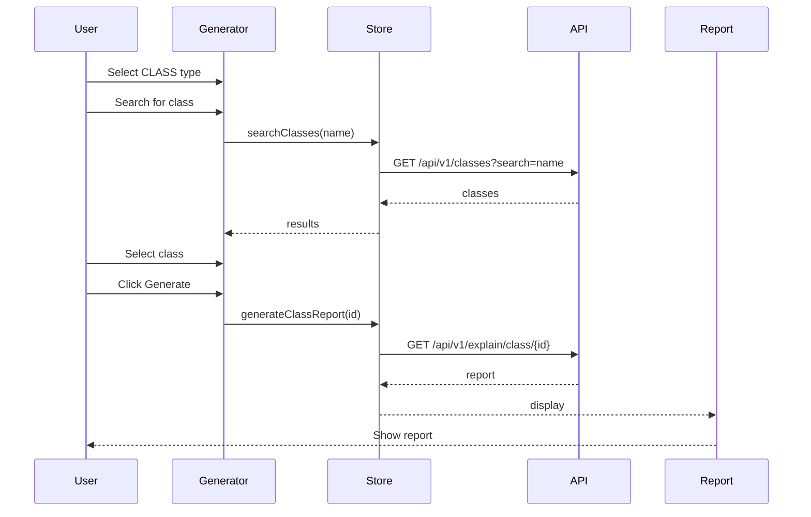
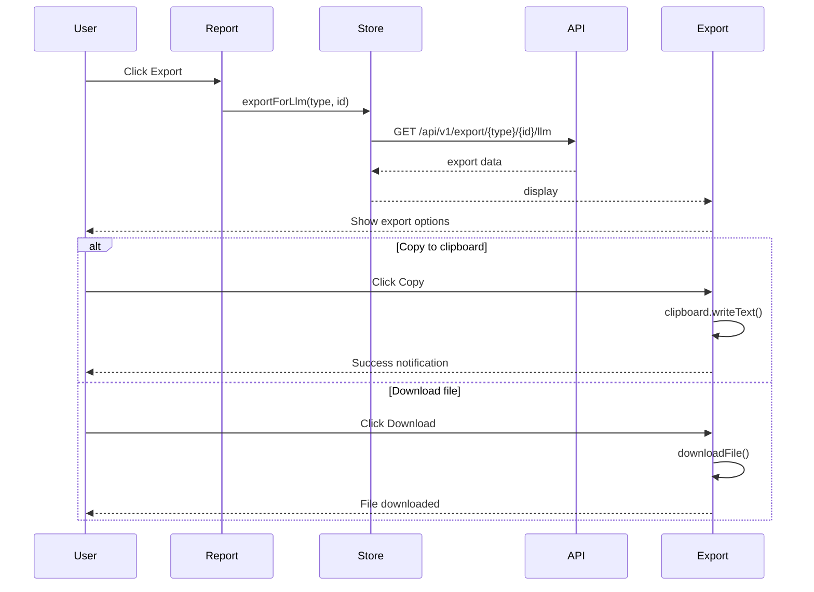

# AGENTS.md: Тестирование модуля Report (Frontend)

Правила и структура тестирования для модуля report UI. Содержит тестовые профили для Vitest unit тестов и Cypress E2E тестов.

---

## Структура тестов

```
src/test/vue/report/
├── unit/
│   ├── ReportGenerator.spec.ts
│   ├── EndpointReport.spec.ts
│   ├── ClassReport.spec.ts
│   ├── MethodReport.spec.ts
│   ├── LlmExport.spec.ts
│   └── store/
│       └── reportStore.spec.ts
├── e2e/
│   ├── report-generation.cy.ts
│   └── llm-export.cy.ts
└── profile/
    └── ReportTestProfile.ts
```

---

## Тестовые профили

### ReportTestProfile.ts

```typescript
/**
 * Тестовый профиль для модуля Report UI.
 */
export class ReportTestProfile {
  
  /**
   * Создает тестовый отчет по endpoint.
   */
  static createEndpointReport(): EndpointReport {
    return {
      elementId: 'test-endpoint-id',
      reportType: 'ENDPOINT',
      summary: 'REST endpoint for user management',
      generatedAt: new Date().toISOString(),
      endpoint: {
        id: 'test-endpoint-id',
        path: '/api/users',
        httpMethod: 'GET',
        produces: 'application/json',
        consumes: null
      },
      exposingMethod: {
        id: 'test-method-id',
        name: 'getUsers',
        signature: 'public List<User> getUsers()',
        returnType: 'List<User>'
      },
      controllerClass: {
        id: 'test-class-id',
        name: 'UserController',
        fullName: 'com.example.controller.UserController',
        packageName: 'com.example.controller',
        labels: ['RestController']
      },
      callChain: [
        {
          methodId: 'method-1',
          methodName: 'getUsers',
          classId: 'class-1',
          className: 'UserController',
          serviceName: 'UserController',
          depth: 0
        },
        {
          methodId: 'method-2',
          methodName: 'getAllUsers',
          classId: 'class-2',
          className: 'UserService',
          serviceName: 'UserService',
          depth: 1
        }
      ],
      dependencies: [
        {
          id: 'dep-1',
          targetClassName: 'UserService',
          fieldName: 'userService'
        }
      ]
    };
  }
  
  /**
   * Создает тестовый отчет по классу.
   */
  static createClassReport(): ClassReport {
    return {
      elementId: 'test-class-id',
      reportType: 'CLASS',
      summary: 'Service class for user operations',
      generatedAt: new Date().toISOString(),
      classInfo: {
        id: 'test-class-id',
        name: 'UserService',
        fullName: 'com.example.service.UserService',
        packageName: 'com.example.service',
        labels: ['Service']
      },
      methods: [
        {
          id: 'method-1',
          name: 'getAllUsers',
          signature: 'public List<User> getAllUsers()',
          returnType: 'List<User>'
        },
        {
          id: 'method-2',
          name: 'findById',
          signature: 'public User findById(Long id)',
          returnType: 'User'
        }
      ],
      dependencies: [
        {
          id: 'dep-1',
          targetClassName: 'UserRepository',
          fieldName: 'userRepository'
        }
      ],
      dependents: [
        {
          id: 'dep-2',
          targetClassName: 'UserController',
          fieldName: 'userService'
        }
      ],
      exposedEndpoints: []
    };
  }
  
  /**
   * Создает тестовый отчет по методу.
   */
  static createMethodReport(): MethodReport {
    return {
      elementId: 'test-method-id',
      reportType: 'METHOD',
      summary: 'Method for retrieving all users',
      generatedAt: new Date().toISOString(),
      methodInfo: {
        id: 'test-method-id',
        name: 'getAllUsers',
        signature: 'public List<User> getAllUsers()',
        returnType: 'List<User>',
        modifiers: ['public'],
        parameters: []
      },
      parentClass: {
        id: 'test-class-id',
        name: 'UserService',
        fullName: 'com.example.service.UserService',
        packageName: 'com.example.service',
        labels: ['Service']
      },
      calledMethods: [
        {
          methodId: 'called-method-1',
          methodName: 'findAll',
          className: 'UserRepository'
        }
      ],
      callingMethods: [
        {
          methodId: 'calling-method-1',
          methodName: 'getUsers',
          className: 'UserController'
        }
      ],
      fieldAccesses: []
    };
  }
  
  /**
   * Создает тестовый экспорт для LLM.
   */
  static createLlmExport(): LlmContextExport {
    return {
      contextType: 'CLASS',
      elementId: 'test-class-id',
      summary: 'Service class for user operations',
      structuredData: {
        name: 'UserService',
        package: 'com.example.service',
        methods: ['getAllUsers', 'findById'],
        dependencies: ['UserRepository']
      },
      promptTemplate: 'Analyze the following Spring Service class:\n\nUserService'
    };
  }
  
  /**
   * Создает начальное состояние store.
   */
  static createInitialState(): ReportState {
    return {
      currentReport: null,
      reportType: null,
      llmExport: null,
      loading: false,
      error: null
    };
  }
  
  /**
   * Создает состояние с загруженным отчетом.
   */
  static createLoadedState(): ReportState {
    return {
      currentReport: this.createClassReport(),
      reportType: 'CLASS',
      llmExport: null,
      loading: false,
      error: null
    };
  }
}
```

---

## Unit тесты (Vitest)

### ReportGenerator.spec.ts

```typescript
/**
 * Unit тесты для компонента ReportGenerator.
 */
import { describe, it, expect, vi, beforeEach } from 'vitest';
import { mount } from '@vue/test-utils';
import { createTestingPinia } from '@pinia/testing';
import ReportGenerator from '@/report/view/ReportGenerator.vue';
import { ReportTestProfile } from './profile/ReportTestProfile';

describe('ReportGenerator', () => {
  let wrapper: any;
  
  beforeEach(() => {
    wrapper = mount(ReportGenerator, {
      global: {
        plugins: [
          createTestingPinia({
            initialState: {
              report: ReportTestProfile.createInitialState()
            }
          })
        ]
      }
    });
  });
  
  it('should render report type selector', () => {
    expect(wrapper.find('[data-test="report-type-selector"]').exists()).toBe(true);
  });
  
  it('should show element search input', () => {
    expect(wrapper.find('[data-test="element-search"]').exists()).toBe(true);
  });
  
  it('should disable generate button without selection', () => {
    const generateBtn = wrapper.find('[data-test="generate-btn"]');
    expect(generateBtn.attributes('disabled')).toBeDefined();
  });
  
  it('should enable generate button with selection', async () => {
    await wrapper.find('[data-test="report-type-selector"]').setValue('CLASS');
    await wrapper.find('[data-test="element-search"]').setValue('UserService');
    
    const generateBtn = wrapper.find('[data-test="generate-btn"]');
    expect(generateBtn.attributes('disabled')).toBeUndefined();
  });
  
  it('should emit generate event', async () => {
    await wrapper.find('[data-test="report-type-selector"]').setValue('CLASS');
    await wrapper.find('[data-test="element-search"]').setValue('UserService');
    await wrapper.find('[data-test="generate-btn"]').trigger('click');
    
    expect(wrapper.emitted('generate')).toBeTruthy();
  });
  
  it('should show recent reports section', () => {
    expect(wrapper.find('[data-test="recent-reports"]').exists()).toBe(true);
  });
});
```

### ClassReport.spec.ts

```typescript
/**
 * Unit тесты для компонента ClassReport.
 */
import { describe, it, expect, vi, beforeEach } from 'vitest';
import { mount } from '@vue/test-utils';
import { createTestingPinia } from '@pinia/testing';
import ClassReport from '@/report/view/ClassReport.vue';
import { ReportTestProfile } from './profile/ReportTestProfile';

describe('ClassReport', () => {
  let wrapper: any;
  
  beforeEach(() => {
    wrapper = mount(ClassReport, {
      props: {
        report: ReportTestProfile.createClassReport()
      }
    });
  });
  
  it('should display class name', () => {
    expect(wrapper.find('[data-test="class-name"]').text()).toBe('UserService');
  });
  
  it('should display class summary', () => {
    expect(wrapper.find('[data-test="class-summary"]').text()).toContain('Service class for user operations');
  });
  
  it('should display class labels', () => {
    const labels = wrapper.findAll('[data-test="label-badge"]');
    expect(labels.length).toBe(1);
    expect(labels[0].text()).toBe('Service');
  });
  
  it('should display methods list', () => {
    const methods = wrapper.findAll('[data-test="method-item"]');
    expect(methods.length).toBe(2);
  });
  
  it('should display dependencies', () => {
    const dependencies = wrapper.findAll('[data-test="dependency-item"]');
    expect(dependencies.length).toBe(1);
    expect(dependencies[0].text()).toContain('UserRepository');
  });
  
  it('should display dependents', () => {
    const dependents = wrapper.findAll('[data-test="dependent-item"]');
    expect(dependents.length).toBe(1);
    expect(dependents[0].text()).toContain('UserController');
  });
  
  it('should emit navigate event on dependency click', async () => {
    const dependencyLink = wrapper.find('[data-test="dependency-link"]');
    await dependencyLink.trigger('click');
    
    expect(wrapper.emitted('navigate')).toBeTruthy();
  });
  
  it('should show export button', () => {
    expect(wrapper.find('[data-test="export-btn"]').exists()).toBe(true);
  });
  
  it('should emit export event', async () => {
    const exportBtn = wrapper.find('[data-test="export-btn"]');
    await exportBtn.trigger('click');
    
    expect(wrapper.emitted('export')).toBeTruthy();
  });
});
```

### EndpointReport.spec.ts

```typescript
/**
 * Unit тесты для компонента EndpointReport.
 */
import { describe, it, expect, vi, beforeEach } from 'vitest';
import { mount } from '@vue/test-utils';
import EndpointReport from '@/report/view/EndpointReport.vue';
import { ReportTestProfile } from './profile/ReportTestProfile';

describe('EndpointReport', () => {
  let wrapper: any;
  
  beforeEach(() => {
    wrapper = mount(EndpointReport, {
      props: {
        report: ReportTestProfile.createEndpointReport()
      }
    });
  });
  
  it('should display endpoint path', () => {
    expect(wrapper.find('[data-test="endpoint-path"]').text()).toBe('/api/users');
  });
  
  it('should display HTTP method', () => {
    expect(wrapper.find('[data-test="http-method"]').text()).toBe('GET');
  });
  
  it('should display controller name', () => {
    expect(wrapper.find('[data-test="controller-name"]').text()).toContain('UserController');
  });
  
  it('should display exposing method', () => {
    expect(wrapper.find('[data-test="exposing-method"]').text()).toContain('getUsers');
  });
  
  it('should display call chain', () => {
    const callChain = wrapper.findAll('[data-test="call-chain-item"]');
    expect(callChain.length).toBe(2);
  });
  
  it('should show call chain depth indicators', () => {
    const depthIndicators = wrapper.findAll('[data-test="depth-indicator"]');
    expect(depthIndicators.length).toBe(2);
  });
  
  it('should emit navigate event on call chain click', async () => {
    const callChainItem = wrapper.find('[data-test="call-chain-item"]');
    await callChainItem.trigger('click');
    
    expect(wrapper.emitted('navigate')).toBeTruthy();
  });
});
```

### LlmExport.spec.ts

```typescript
/**
 * Unit тесты для компонента LlmExport.
 */
import { describe, it, expect, vi, beforeEach } from 'vitest';
import { mount } from '@vue/test-utils';
import { createTestingPinia } from '@pinia/testing';
import LlmExport from '@/report/view/LlmExport.vue';
import { ReportTestProfile } from './profile/ReportTestProfile';

describe('LlmExport', () => {
  let wrapper: any;
  
  beforeEach(() => {
    wrapper = mount(LlmExport, {
      props: {
        export: ReportTestProfile.createLlmExport()
      }
    });
  });
  
  it('should display context type', () => {
    expect(wrapper.find('[data-test="context-type"]').text()).toBe('CLASS');
  });
  
  it('should display element name', () => {
    expect(wrapper.find('[data-test="element-name"]').text()).toContain('UserService');
  });
  
  it('should display structured data', () => {
    expect(wrapper.find('[data-test="structured-data"]').exists()).toBe(true);
  });
  
  it('should show JSON format by default', () => {
    expect(wrapper.find('[data-test="json-view"]').exists()).toBe(true);
  });
  
  it('should switch to markdown format', async () => {
    await wrapper.find('[data-test="format-selector"]').setValue('markdown');
    
    expect(wrapper.find('[data-test="markdown-view"]').exists()).toBe(true);
  });
  
  it('should have copy button', () => {
    expect(wrapper.find('[data-test="copy-btn"]').exists()).toBe(true);
  });
  
  it('should copy to clipboard', async () => {
    const mockClipboard = {
      writeText: vi.fn().mockResolvedValue(undefined)
    };
    Object.assign(navigator, { clipboard: mockClipboard });
    
    await wrapper.find('[data-test="copy-btn"]').trigger('click');
    
    expect(mockClipboard.writeText).toHaveBeenCalled();
  });
  
  it('should have download button', () => {
    expect(wrapper.find('[data-test="download-btn"]').exists()).toBe(true);
  });
  
  it('should emit download event', async () => {
    const downloadBtn = wrapper.find('[data-test="download-btn"]');
    await downloadBtn.trigger('click');
    
    expect(wrapper.emitted('download')).toBeTruthy();
  });
});
```

### reportStore.spec.ts

```typescript
/**
 * Unit тесты для report store.
 */
import { describe, it, expect, vi, beforeEach } from 'vitest';
import { setActivePinia, createPinia } from 'pinia';
import { useReportStore } from '@/report/store/reportStore';
import { reportApi } from '@/report/api/reportApi';
import { ReportTestProfile } from './profile/ReportTestProfile';

vi.mock('@/report/api/reportApi');

describe('reportStore', () => {
  let store: ReturnType<typeof useReportStore>;
  
  beforeEach(() => {
    setActivePinia(createPinia());
    store = useReportStore();
    vi.clearAllMocks();
  });
  
  describe('generateEndpointReport', () => {
    it('should generate endpoint report', async () => {
      const report = ReportTestProfile.createEndpointReport();
      vi.mocked(reportApi.explainEndpoint).mockResolvedValue(report);
      
      await store.generateEndpointReport('test-endpoint-id');
      
      expect(store.currentReport).toEqual(report);
      expect(store.reportType).toBe('ENDPOINT');
    });
  });
  
  describe('generateClassReport', () => {
    it('should generate class report', async () => {
      const report = ReportTestProfile.createClassReport();
      vi.mocked(reportApi.explainClass).mockResolvedValue(report);
      
      await store.generateClassReport('test-class-id');
      
      expect(store.currentReport).toEqual(report);
      expect(store.reportType).toBe('CLASS');
    });
    
    it('should generate report by full name', async () => {
      const report = ReportTestProfile.createClassReport();
      vi.mocked(reportApi.explainClassByName).mockResolvedValue(report);
      
      await store.generateClassReportByName('com.example.service.UserService');
      
      expect(store.currentReport).toEqual(report);
    });
  });
  
  describe('generateMethodReport', () => {
    it('should generate method report', async () => {
      const report = ReportTestProfile.createMethodReport();
      vi.mocked(reportApi.explainMethod).mockResolvedValue(report);
      
      await store.generateMethodReport('test-method-id');
      
      expect(store.currentReport).toEqual(report);
      expect(store.reportType).toBe('METHOD');
    });
  });
  
  describe('exportForLlm', () => {
    it('should export context for LLM', async () => {
      const exportData = ReportTestProfile.createLlmExport();
      vi.mocked(reportApi.exportForLlm).mockResolvedValue(exportData);
      
      await store.exportForLlm('CLASS', 'test-class-id');
      
      expect(store.llmExport).toEqual(exportData);
    });
    
    it('should support different formats', async () => {
      const exportData = { ...ReportTestProfile.createLlmExport(), format: 'markdown' };
      vi.mocked(reportApi.exportForLlm).mockResolvedValue(exportData);
      
      await store.exportForLlm('CLASS', 'test-class-id', 'markdown');
      
      expect(store.llmExport?.format).toBe('markdown');
    });
  });
  
  describe('clearReport', () => {
    it('should clear current report', () => {
      store.currentReport = ReportTestProfile.createClassReport();
      
      store.clearReport();
      
      expect(store.currentReport).toBeNull();
      expect(store.reportType).toBeNull();
    });
  });
});
```

---

## E2E тесты (Cypress)

### report-generation.cy.ts

```typescript
/**
 * E2E тесты для генерации отчетов.
 */
describe('Report Generation', () => {
  beforeEach(() => {
    cy.resetDatabase();
    cy.seedArchitectureData();
    cy.visit('/report');
  });
  
  it('should generate class report', () => {
    cy.get('[data-test="report-type-selector"]').select('CLASS');
    cy.get('[data-test="element-search"]').type('UserService');
    cy.get('[data-test="search-result"]').first().click();
    cy.get('[data-test="generate-btn"]').click();
    
    cy.get('[data-test="class-report"]').should('be.visible');
    cy.get('[data-test="class-name"]').should('contain', 'UserService');
  });
  
  it('should generate endpoint report', () => {
    cy.get('[data-test="report-type-selector"]').select('ENDPOINT');
    cy.get('[data-test="element-search"]').type('/api/users');
    cy.get('[data-test="search-result"]').first().click();
    cy.get('[data-test="generate-btn"]').click();
    
    cy.get('[data-test="endpoint-report"]').should('be.visible');
    cy.get('[data-test="endpoint-path"]').should('contain', '/api/users');
  });
  
  it('should generate method report', () => {
    cy.get('[data-test="report-type-selector"]').select('METHOD');
    cy.get('[data-test="element-search"]').type('getAllUsers');
    cy.get('[data-test="search-result"]').first().click();
    cy.get('[data-test="generate-btn"]').click();
    
    cy.get('[data-test="method-report"]').should('be.visible');
    cy.get('[data-test="method-name"]').should('contain', 'getAllUsers');
  });
  
  it('should navigate from report to class', () => {
    // Generate class report first
    cy.get('[data-test="report-type-selector"]').select('CLASS');
    cy.get('[data-test="element-search"]').type('UserService');
    cy.get('[data-test="search-result"]').first().click();
    cy.get('[data-test="generate-btn"]').click();
    
    // Click on dependency
    cy.get('[data-test="dependency-link"]').first().click();
    
    // Should show new report
    cy.get('[data-test="class-report"]').should('be.visible');
  });
  
  it('should show call chain in endpoint report', () => {
    cy.get('[data-test="report-type-selector"]').select('ENDPOINT');
    cy.get('[data-test="element-search"]').type('/api/users');
    cy.get('[data-test="search-result"]').first().click();
    cy.get('[data-test="generate-btn"]').click();
    
    cy.get('[data-test="call-chain-item"]').should('have.length.at.least', 1);
  });
});

describe('LLM Export', () => {
  beforeEach(() => {
    cy.resetDatabase();
    cy.seedArchitectureData();
    cy.visit('/report');
  });
  
  it('should export report for LLM', () => {
    // Generate report first
    cy.get('[data-test="report-type-selector"]').select('CLASS');
    cy.get('[data-test="element-search"]').type('UserService');
    cy.get('[data-test="search-result"]').first().click();
    cy.get('[data-test="generate-btn"]').click();
    
    // Export
    cy.get('[data-test="export-btn"]').click();
    
    cy.get('[data-test="llm-export"]').should('be.visible');
    cy.get('[data-test="structured-data"]').should('exist');
  });
  
  it('should copy export to clipboard', () => {
    // Generate and export
    cy.get('[data-test="report-type-selector"]').select('CLASS');
    cy.get('[data-test="element-search"]').type('UserService');
    cy.get('[data-test="search-result"]').first().click();
    cy.get('[data-test="generate-btn"]').click();
    cy.get('[data-test="export-btn"]').click();
    
    cy.get('[data-test="copy-btn"]').click();
    
    cy.get('[data-test="notification"]').should('contain', 'Copied to clipboard');
  });
  
  it('should download export as file', () => {
    // Generate and export
    cy.get('[data-test="report-type-selector"]').select('CLASS');
    cy.get('[data-test="element-search"]').type('UserService');
    cy.get('[data-test="search-result"]').first().click();
    cy.get('[data-test="generate-btn"]').click();
    cy.get('[data-test="export-btn"]').click();
    
    cy.get('[data-test="download-btn"]').click();
    
    // Verify download
    cy.readFile('cypress/downloads/UserService-context.json').should('exist');
  });
  
  it('should switch export format', () => {
    // Generate and export
    cy.get('[data-test="report-type-selector"]').select('CLASS');
    cy.get('[data-test="element-search"]').type('UserService');
    cy.get('[data-test="search-result"]').first().click();
    cy.get('[data-test="generate-btn"]').click();
    cy.get('[data-test="export-btn"]').click();
    
    cy.get('[data-test="format-selector"]').select('markdown');
    
    cy.get('[data-test="markdown-view"]').should('be.visible');
  });
});
```

---

## Тестовые сценарии

### Сценарий: Генерация отчета по классу



### Сценарий: Экспорт для LLM



---

## Критерии приемки

| Критерий | Описание |
|----------|----------|
| Unit тесты | Все компоненты покрыты |
| Store тесты | Все actions покрыты |
| E2E тесты | Генерация отчетов проверена |
| Экспорт | JSON и Markdown форматы работают |
| Навигация | Переходы между отчетами работают |
| Copy/Download | Функции экспорта работают |