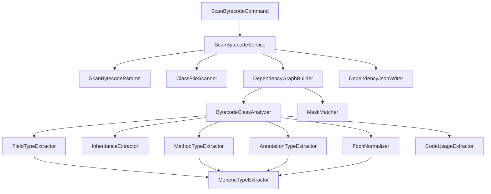

# scan-bytecode — План реализации

## Обзор

Команда `spring-twin scan-bytecode` анализирует `.class` файлы и извлекает структурные зависимости между классами. Результат сохраняется в `dependencies.json` в формате `Map<String, Set<String>>`, где ключ — полное имя класса (FQCN), а множество — все классы, на которые он ссылается.

## Виды связей (по SPEC)

- Наследование класса или интерфейса
- Имплементация интерфейса
- Поле класса
- Аргумент метода или конструктора
- Возвращаемый тип метода
- Использование в коде (статическая инициализация, тело метода: вызов метода, объявление переменной и т.д.)
- Аннотации

## Специальная обработка типов

- **Массивы** — ссылка на базовый тип, а не на массив
- **Generics** — ссылка на все типы: сам тип, его generic-параметры и вложенные generic-и

## Архитектура

## Пакеты

| Пакет | Назначение |
|-------|-----------|
| `spring.twin.scan` | Основные классы scan-bytecode |
| `spring.twin.command` | CLI команды |

## Зависимости (build.gradle.kts)

Для реализации потребуется добавить:
- `org.ow2.asm:asm-tree` — анализ байткода (включает `asm`)
- `info.picocli:picocli-spring-boot-starter` — CLI парсинг (или `org.springframework.shell:spring-shell-starter`)
- `com.fasterxml.jackson.core:jackson-databind` — уже есть через spring-boot-starter

## Порядок реализации

| #   | Реализация | Фича                      | Описание                                                            | Зависимости   |
|-----|------------|---------------------------|---------------------------------------------------------------------|---------------|
| 001 | +          | scan-params               | DTO параметров команды и парсер                                     | —             |
| 002 | +          | fqcn-normalizer           | Нормализация имён классов из JVM дескрипторов                       | —             |
| 003 | +          | mask-matcher              | Сопоставление FQCN с масками include/exclude                        | —             |
| 004 | +          | class-file-scanner        | Рекурсивное сканирование директории для поиска .class файлов        | —             |
| 005 | +          | generic-type-extractor    | Извлечение типов из generic-сигнатур                                | 002           |
| 006 | +          | inheritance-extractor     | Извлечение зависимостей наследования и имплементации                | 002, 005      |
| 007 | -          | field-type-extractor      | Извлечение зависимостей по типам полей                              | 002, 005      |
| 008 | -          | method-type-extractor     | Извлечение зависимостей по типам параметров и возвращаемых значений | 002, 005      |
| 009 | -          | annotation-type-extractor | Извлечение зависимостей по аннотациям                               | 002, 005      |
| 010 | -          | code-usage-extractor      | Извлечение зависимостей по использованию в коде методов             | 002           |
| 011 | -          | bytecode-class-analyzer   | Оркестрация экстракторов для одного класса                          | 006–010       |
| 012 | -          | dependency-graph-builder  | Построение полного графа зависимостей                               | 004, 011, 003 |
| 013 | -          | dependency-json-writer    | Запись графа зависимостей в JSON файл                               | —             |
| 014 | -          | scan-bytecode-service     | Главный сервис пайплайна scan-bytecode                              | 001, 012, 013 |
| 015 | -          | cli-command               | CLI команда scan-bytecode                                           | 001, 014      |
| 016 | -          | e2e-tests                 | End-to-end тесты полного пайплайна                                  | 015           |

## Чек-лист задач

Каждая фича имеет 4 задачи в порядке реализации: **api** → **tests** → **code** → **fix**

### Фича 001: scan-params
- [+] [001-scan-params-api](scan-bytecode/001-scan-params-api.md)
- [+] [001-scan-params-tests](scan-bytecode/001-scan-params-tests.md)
- [+] [001-scan-params-code](scan-bytecode/001-scan-params-code.md)
- [+] [001-scan-params-fix](scan-bytecode/001-scan-params-fix.md)

### Фича 002: fqcn-normalizer
- [+] [002-fqcn-normalizer-api](scan-bytecode/002-fqcn-normalizer-api.md)
- [+] [002-fqcn-normalizer-tests](scan-bytecode/002-fqcn-normalizer-tests.md)
- [+] [002-fqcn-normalizer-code](scan-bytecode/002-fqcn-normalizer-code.md)
- [+] [002-fqcn-normalizer-fix](scan-bytecode/002-fqcn-normalizer-fix.md)

### Фича 003: mask-matcher
- [+] [003-mask-matcher-api](scan-bytecode/003-mask-matcher-api.md)
- [+] [003-mask-matcher-tests](scan-bytecode/003-mask-matcher-tests.md)
- [+] [003-mask-matcher-code](scan-bytecode/003-mask-matcher-code.md)
- [+] [003-mask-matcher-fix](scan-bytecode/003-mask-matcher-fix.md)

### Фича 004: class-file-scanner
- [+] [004-class-file-scanner-api](scan-bytecode/004-class-file-scanner-api.md)
- [+] [004-class-file-scanner-tests](scan-bytecode/004-class-file-scanner-tests.md)
- [+] [004-class-file-scanner-code](scan-bytecode/004-class-file-scanner-code.md)
- [+] [004-class-file-scanner-fix](scan-bytecode/004-class-file-scanner-fix.md)

### Фича 005: generic-type-extractor
- [+] [005-generic-type-extractor-api](scan-bytecode/005-generic-type-extractor-api.md)
- [+] [005-generic-type-extractor-tests](scan-bytecode/005-generic-type-extractor-tests.md)
- [+] [005-generic-type-extractor-code](scan-bytecode/005-generic-type-extractor-code.md)
- [+] [005-generic-type-extractor-fix](scan-bytecode/005-generic-type-extractor-fix.md)

### Фича 006: inheritance-extractor
- [+] [006-inheritance-extractor-api](scan-bytecode/006-inheritance-extractor-api.md)
- [+] [006-inheritance-extractor-tests](scan-bytecode/006-inheritance-extractor-tests.md)
- [+] [006-inheritance-extractor-code](scan-bytecode/006-inheritance-extractor-code.md)
- [+] [006-inheritance-extractor-fix](scan-bytecode/006-inheritance-extractor-fix.md)

### Фича 007: field-type-extractor
- [ ] [007-field-type-extractor-api](scan-bytecode/007-field-type-extractor-api.md)
- [ ] [007-field-type-extractor-tests](scan-bytecode/007-field-type-extractor-tests.md)
- [ ] [007-field-type-extractor-code](scan-bytecode/007-field-type-extractor-code.md)
- [ ] [007-field-type-extractor-fix](scan-bytecode/007-field-type-extractor-fix.md)

### Фича 008: method-type-extractor
- [ ] [008-method-type-extractor-api](scan-bytecode/008-method-type-extractor-api.md)
- [ ] [008-method-type-extractor-tests](scan-bytecode/008-method-type-extractor-tests.md)
- [ ] [008-method-type-extractor-code](scan-bytecode/008-method-type-extractor-code.md)
- [ ] [008-method-type-extractor-fix](scan-bytecode/008-method-type-extractor-fix.md)

### Фича 009: annotation-type-extractor
- [ ] [009-annotation-type-extractor-api](scan-bytecode/009-annotation-type-extractor-api.md)
- [ ] [009-annotation-type-extractor-tests](scan-bytecode/009-annotation-type-extractor-tests.md)
- [ ] [009-annotation-type-extractor-code](scan-bytecode/009-annotation-type-extractor-code.md)
- [ ] [009-annotation-type-extractor-fix](scan-bytecode/009-annotation-type-extractor-fix.md)

### Фича 010: code-usage-extractor
- [ ] [010-code-usage-extractor-api](scan-bytecode/010-code-usage-extractor-api.md)
- [ ] [010-code-usage-extractor-tests](scan-bytecode/010-code-usage-extractor-tests.md)
- [ ] [010-code-usage-extractor-code](scan-bytecode/010-code-usage-extractor-code.md)
- [ ] [010-code-usage-extractor-fix](scan-bytecode/010-code-usage-extractor-fix.md)

### Фича 011: bytecode-class-analyzer
- [ ] [011-bytecode-class-analyzer-api](scan-bytecode/011-bytecode-class-analyzer-api.md)
- [ ] [011-bytecode-class-analyzer-tests](scan-bytecode/011-bytecode-class-analyzer-tests.md)
- [ ] [011-bytecode-class-analyzer-code](scan-bytecode/011-bytecode-class-analyzer-code.md)
- [ ] [011-bytecode-class-analyzer-fix](scan-bytecode/011-bytecode-class-analyzer-fix.md)

### Фича 012: dependency-graph-builder
- [ ] [012-dependency-graph-builder-api](scan-bytecode/012-dependency-graph-builder-api.md)
- [ ] [012-dependency-graph-builder-tests](scan-bytecode/012-dependency-graph-builder-tests.md)
- [ ] [012-dependency-graph-builder-code](scan-bytecode/012-dependency-graph-builder-code.md)
- [ ] [012-dependency-graph-builder-fix](scan-bytecode/012-dependency-graph-builder-fix.md)

### Фича 013: dependency-json-writer
- [ ] [013-dependency-json-writer-api](scan-bytecode/013-dependency-json-writer-api.md)
- [ ] [013-dependency-json-writer-tests](scan-bytecode/013-dependency-json-writer-tests.md)
- [ ] [013-dependency-json-writer-code](scan-bytecode/013-dependency-json-writer-code.md)
- [ ] [013-dependency-json-writer-fix](scan-bytecode/013-dependency-json-writer-fix.md)

### Фича 014: scan-bytecode-service
- [ ] [014-scan-bytecode-service-api](scan-bytecode/014-scan-bytecode-service-api.md)
- [ ] [014-scan-bytecode-service-tests](scan-bytecode/014-scan-bytecode-service-tests.md)
- [ ] [014-scan-bytecode-service-code](scan-bytecode/014-scan-bytecode-service-code.md)
- [ ] [014-scan-bytecode-service-fix](scan-bytecode/014-scan-bytecode-service-fix.md)

### Фича 015: cli-command
- [ ] [015-cli-command-api](scan-bytecode/015-cli-command-api.md)
- [ ] [015-cli-command-tests](scan-bytecode/015-cli-command-tests.md)
- [ ] [015-cli-command-code](scan-bytecode/015-cli-command-code.md)
- [ ] [015-cli-command-fix](scan-bytecode/015-cli-command-fix.md)

### Фича 016: e2e-tests
- [ ] [016-e2e-tests-api](scan-bytecode/016-e2e-tests-api.md)
- [ ] [016-e2e-tests-tests](scan-bytecode/016-e2e-tests-tests.md)
- [ ] [016-e2e-tests-code](scan-bytecode/016-e2e-tests-code.md)
- [ ] [016-e2e-tests-fix](scan-bytecode/016-e2e-tests-fix.md)