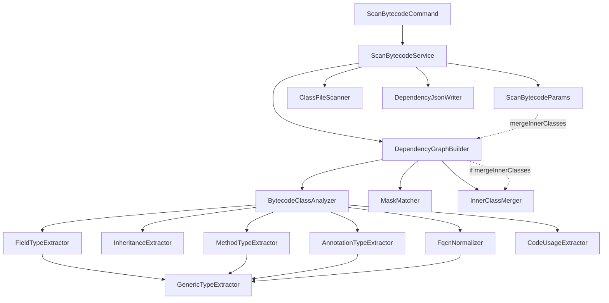

# scan-bytecode — План реализации

## Обзор

Команда `spring-twin scan-bytecode` анализирует `.class` файлы и извлекает структурные зависимости между классами. Результат сохраняется в `dependencies.json` в формате `Map<String, Map<String, Set<LinkDetails>>>`, где ключ первого уровня — полное имя класса (FQCN), ключ второго уровня — полное имя класса, на который он ссылается, а значение — множество деталей ссылки `LinkDetails` с типом связи и описанием.

## Виды связей (по SPEC)

- Наследование класса или интерфейса
- Имплементация интерфейса
- Поле класса
- Аргумент метода или конструктора
- Возвращаемый тип метода
- Использование в коде (статическая инициализация, тело метода: вызов метода, объявление переменной и т.д.)
- Аннотации

## Специальная обработка типов

- **Массивы** — ссылка на базовый тип, а не на массив
- **Generics** — ссылка на все типы: сам тип, его generic-параметры и вложенные generic-и

## Архитектура

## Пакеты

| Пакет | Назначение |
|-------|-----------|
| `spring.twin.scan` | Основные классы scan-bytecode |
| `spring.twin.command` | CLI команды |

## Зависимости (build.gradle.kts)

Для реализации потребуется добавить:
- `org.ow2.asm:asm-tree` — анализ байткода (включает `asm`)
- `info.picocli:picocli-spring-boot-starter` — CLI парсинг (или `org.springframework.shell:spring-shell-starter`)
- `com.fasterxml.jackson.core:jackson-databind` — уже есть через spring-boot-starter

## Порядок реализации

| #   | Реализация | Фича                      | Описание                                                            | Зависимости   |
|-----|------------|---------------------------|---------------------------------------------------------------------|---------------|
| 001 | +          | scan-params               | DTO параметров команды и парсер                                     | —             |
| 002 | +          | fqcn-normalizer           | Нормализация имён классов из JVM дескрипторов                       | —             |
| 003 | +          | mask-matcher              | Сопоставление FQCN с масками include/exclude                        | —             |
| 004 | +          | class-file-scanner        | Рекурсивное сканирование директории для поиска .class файлов        | —             |
| 005 | +          | generic-type-extractor    | Извлечение типов из generic-сигнатур                                | 002           |
| 006 | +          | inheritance-extractor     | Извлечение зависимостей наследования и имплементации                | 002, 005      |
| 007 | +          | field-type-extractor      | Извлечение зависимостей по типам полей                              | 002, 005      |
| 008 | +          | method-type-extractor     | Извлечение зависимостей по типам параметров и возвращаемых значений | 002, 005      |
| 009 | +          | annotation-type-extractor | Извлечение зависимостей по аннотациям                               | 002, 005      |
| 010 | +          | code-usage-extractor      | Извлечение зависимостей по использованию в коде методов             | 002           |
| 011 | +          | bytecode-class-analyzer   | Оркестрация экстракторов для одного класса                          | 006–010       |
| 012 | +          | dependency-graph-builder  | Построение полного графа зависимостей                               | 004, 011, 003 |
| 013 | +          | dependency-json-writer    | Запись графа зависимостей в JSON файл                               | —             |
| 014 | +          | scan-bytecode-service     | Главный сервис пайплайна scan-bytecode                              | 001, 012, 013 |
| 015 | +          | cli-command               | CLI команда scan-bytecode                                           | 001, 014      |
| 016 | +          | e2e-tests                 | End-to-end тесты полного пайплайна                                  | 015           |
| 017 | +          | inner-class-merger        | Утилитный класс для объединения вложенных классов с родительскими   | —             |
| 018 | +          | scan-params-merge         | Добавление поля mergeInnerClasses в ScanBytecodeParams              | —             |
| 019 | +          | graph-builder-merge       | Поддержка merge-inner-classes в DependencyGraphBuilder              | 017           |
| 020 | +          | service-merge             | Передача mergeInnerClasses из ScanBytecodeParams в builder          | 018, 019      |
| 021 | +          | cli-merge                 | Добавление опции --merge-inner-classes в CLI команду                | 018, 020      |
| 022 | +          | e2e-merge-tests           | End-to-end тесты для merge-inner-classes                            | 021           |

## Чек-лист задач

Каждая фича имеет 4 задачи в порядке реализации: **api** → **tests** → **code** → **fix**

### Фича 001: scan-params
- [+] [001-scan-params-api](scan-bytecode/001-scan-params-api.md)
- [+] [001-scan-params-tests](scan-bytecode/001-scan-params-tests.md)
- [+] [001-scan-params-code](scan-bytecode/001-scan-params-code.md)
- [+] [001-scan-params-fix](scan-bytecode/001-scan-params-fix.md)

### Фича 002: fqcn-normalizer
- [+] [002-fqcn-normalizer-api](scan-bytecode/002-fqcn-normalizer-api.md)
- [+] [002-fqcn-normalizer-tests](scan-bytecode/002-fqcn-normalizer-tests.md)
- [+] [002-fqcn-normalizer-code](scan-bytecode/002-fqcn-normalizer-code.md)
- [+] [002-fqcn-normalizer-fix](scan-bytecode/002-fqcn-normalizer-fix.md)

### Фича 003: mask-matcher
- [+] [003-mask-matcher-api](scan-bytecode/003-mask-matcher-api.md)
- [+] [003-mask-matcher-tests](scan-bytecode/003-mask-matcher-tests.md)
- [+] [003-mask-matcher-code](scan-bytecode/003-mask-matcher-code.md)
- [+] [003-mask-matcher-fix](scan-bytecode/003-mask-matcher-fix.md)

### Фича 004: class-file-scanner
- [+] [004-class-file-scanner-api](scan-bytecode/004-class-file-scanner-api.md)
- [+] [004-class-file-scanner-tests](scan-bytecode/004-class-file-scanner-tests.md)
- [+] [004-class-file-scanner-code](scan-bytecode/004-class-file-scanner-code.md)
- [+] [004-class-file-scanner-fix](scan-bytecode/004-class-file-scanner-fix.md)

### Фича 005: generic-type-extractor
- [+] [005-generic-type-extractor-api](scan-bytecode/005-generic-type-extractor-api.md)
- [+] [005-generic-type-extractor-tests](scan-bytecode/005-generic-type-extractor-tests.md)
- [+] [005-generic-type-extractor-code](scan-bytecode/005-generic-type-extractor-code.md)
- [+] [005-generic-type-extractor-fix](scan-bytecode/005-generic-type-extractor-fix.md)

### Фича 006: inheritance-extractor
- [+] [006-inheritance-extractor-api](scan-bytecode/006-inheritance-extractor-api.md)
- [+] [006-inheritance-extractor-tests](scan-bytecode/006-inheritance-extractor-tests.md)
- [+] [006-inheritance-extractor-code](scan-bytecode/006-inheritance-extractor-code.md)
- [+] [006-inheritance-extractor-fix](scan-bytecode/006-inheritance-extractor-fix.md)

### Фича 007: field-type-extractor
- [+] [007-field-type-extractor-api](scan-bytecode/007-field-type-extractor-api.md)
- [+] [007-field-type-extractor-tests](scan-bytecode/007-field-type-extractor-tests.md)
- [+] [007-field-type-extractor-code](scan-bytecode/007-field-type-extractor-code.md)
- [+] [007-field-type-extractor-fix](scan-bytecode/007-field-type-extractor-fix.md)

### Фича 008: method-type-extractor
- [+] [008-method-type-extractor-api](scan-bytecode/008-method-type-extractor-api.md)
- [+] [008-method-type-extractor-tests](scan-bytecode/008-method-type-extractor-tests.md)
- [+] [008-method-type-extractor-code](scan-bytecode/008-method-type-extractor-code.md)
- [+] [008-method-type-extractor-fix](scan-bytecode/008-method-type-extractor-fix.md)

### Фича 009: annotation-type-extractor
- [+] [009-annotation-type-extractor-api](scan-bytecode/009-annotation-type-extractor-api.md)
- [+] [009-annotation-type-extractor-tests](scan-bytecode/009-annotation-type-extractor-tests.md)
- [+] [009-annotation-type-extractor-code](scan-bytecode/009-annotation-type-extractor-code.md)
- [+] [009-annotation-type-extractor-fix](scan-bytecode/009-annotation-type-extractor-fix.md)

### Фича 010: code-usage-extractor
- [+] [010-code-usage-extractor-api](scan-bytecode/010-code-usage-extractor-api.md)
- [+] [010-code-usage-extractor-tests](scan-bytecode/010-code-usage-extractor-tests.md)
- [+] [010-code-usage-extractor-code](scan-bytecode/010-code-usage-extractor-code.md)
- [+] [010-code-usage-extractor-fix](scan-bytecode/010-code-usage-extractor-fix.md)

### Фича 011: bytecode-class-analyzer
- [+] [011-bytecode-class-analyzer-api](scan-bytecode/011-bytecode-class-analyzer-api.md)
- [+] [011-bytecode-class-analyzer-tests](scan-bytecode/011-bytecode-class-analyzer-tests.md)
- [+] [011-bytecode-class-analyzer-code](scan-bytecode/011-bytecode-class-analyzer-code.md)
- [+] [011-bytecode-class-analyzer-fix](scan-bytecode/011-bytecode-class-analyzer-fix.md)

### Фича 012: dependency-graph-builder
- [+] [012-dependency-graph-builder-api](scan-bytecode/012-dependency-graph-builder-api.md)
- [+] [012-dependency-graph-builder-tests](scan-bytecode/012-dependency-graph-builder-tests.md)
- [+] [012-dependency-graph-builder-code](scan-bytecode/012-dependency-graph-builder-code.md)
- [+] [012-dependency-graph-builder-fix](scan-bytecode/012-dependency-graph-builder-fix.md)

### Фича 013: dependency-json-writer
- [+] [013-dependency-json-writer-api](scan-bytecode/013-dependency-json-writer-api.md)
- [+] [013-dependency-json-writer-tests](scan-bytecode/013-dependency-json-writer-tests.md)
- [+] [013-dependency-json-writer-code](scan-bytecode/013-dependency-json-writer-code.md)
- [+] [013-dependency-json-writer-fix](scan-bytecode/013-dependency-json-writer-fix.md)

### Фича 014: scan-bytecode-service
- [+] [014-scan-bytecode-service-api](scan-bytecode/014-scan-bytecode-service-api.md)
- [+] [014-scan-bytecode-service-tests](scan-bytecode/014-scan-bytecode-service-tests.md)
- [+] [014-scan-bytecode-service-code](scan-bytecode/014-scan-bytecode-service-code.md)
- [+] [014-scan-bytecode-service-fix](scan-bytecode/014-scan-bytecode-service-fix.md)

### Фича 015: cli-command
- [+] [015-cli-command-api](scan-bytecode/015-cli-command-api.md)
- [+] [015-cli-command-tests](scan-bytecode/015-cli-command-tests.md)
- [+] [015-cli-command-code](scan-bytecode/015-cli-command-code.md)
- [+] [015-cli-command-fix](scan-bytecode/015-cli-command-fix.md)

### Фича 016: e2e-tests
- [+] [016-e2e-tests-api](scan-bytecode/016-e2e-tests-api.md)
- [+] [016-e2e-tests-tests](scan-bytecode/016-e2e-tests-tests.md)
- [+] [016-e2e-tests-code](scan-bytecode/016-e2e-tests-code.md)
- [+] [016-e2e-tests-fix](scan-bytecode/016-e2e-tests-fix.md)

### Фича 017: inner-class-merger
- [+] [017-inner-class-merger-api](scan-bytecode/017-inner-class-merger-api.md)
- [+] [017-inner-class-merger-tests](scan-bytecode/017-inner-class-merger-tests.md)
- [+] [017-inner-class-merger-code](scan-bytecode/017-inner-class-merger-code.md)
- [+] [017-inner-class-merger-fix](scan-bytecode/017-inner-class-merger-fix.md)

### Фича 018: scan-params-merge
- [+] [018-scan-params-merge-api](scan-bytecode/018-scan-params-merge-api.md)
- [+] [018-scan-params-merge-tests](scan-bytecode/018-scan-params-merge-tests.md)
- [+] [018-scan-params-merge-code](scan-bytecode/018-scan-params-merge-code.md)
- [+] [018-scan-params-merge-fix](scan-bytecode/018-scan-params-merge-fix.md)

### Фича 019: graph-builder-merge
- [+] [019-graph-builder-merge-api](scan-bytecode/019-graph-builder-merge-api.md)
- [+] [019-graph-builder-merge-tests](scan-bytecode/019-graph-builder-merge-tests.md)
- [+] [019-graph-builder-merge-code](scan-bytecode/019-graph-builder-merge-code.md)
- [+] [019-graph-builder-merge-fix](scan-bytecode/019-graph-builder-merge-fix.md)

### Фича 020: service-merge
- [+] [020-service-merge-api](scan-bytecode/020-service-merge-api.md)
- [+] [020-service-merge-tests](scan-bytecode/020-service-merge-tests.md)
- [+] [020-service-merge-code](scan-bytecode/020-service-merge-code.md)
- [+] [020-service-merge-fix](scan-bytecode/020-service-merge-fix.md)

### Фича 021: cli-merge
- [+] [021-cli-merge-api](scan-bytecode/021-cli-merge-api.md)
- [+] [021-cli-merge-tests](scan-bytecode/021-cli-merge-tests.md)
- [+] [021-cli-merge-code](scan-bytecode/021-cli-merge-code.md)
- [+] [021-cli-merge-fix](scan-bytecode/021-cli-merge-fix.md)

### Фича 022: e2e-merge-tests
- [+] [022-e2e-merge-tests-api](scan-bytecode/022-e2e-merge-tests-api.md)
- [+] [022-e2e-merge-tests-tests](scan-bytecode/022-e2e-merge-tests-tests.md)
- [+] [022-e2e-merge-tests-code](scan-bytecode/022-e2e-merge-tests-code.md)
- [+] [022-e2e-merge-tests-fix](scan-bytecode/022-e2e-merge-tests-fix.md)

---

## Этап 2: Поддержка нового формата сохранения данных (LinkDetails)

Переход от формата `Map<String, Set<String>>` к формату `Map<String, Map<String, Set<LinkDetails>>>`.
Каждая связь теперь содержит тип (LinkType) и детали (details).

### Порядок реализации

| #   | Реализация | Фича                              | Описание                                                                 | Зависимости         |
|-----|------------|-----------------------------------|--------------------------------------------------------------------------|---------------------|
| 023 | +          | link-type-enum                    | Перечисление типов связей LinkType                                       | —                   |
| 024 | +          | link-details-model                | Модель данных LinkDetails с type и details                                | 023                 |
| 025 | +          | inheritance-extractor-details     | Детализированное извлечение наследования и имплементации                  | 024                 |
| 026 | +          | field-type-extractor-details      | Детализированное извлечение типов полей                                   | 024                 |
| 027 | -          | method-type-extractor-details     | Детализированное извлечение типов методов                                 | 024                 |
| 028 | -          | annotation-type-extractor-details | Детализированное извлечение аннотаций                                     | 024                 |
| 029 | -          | code-usage-extractor-details      | Детализированное извлечение использования в коде                          | 024                 |
| 030 | -          | bytecode-class-analyzer-details   | Оркестрация детализированных экстракторов                                 | 025–029             |
| 031 | -          | dependency-graph-builder-details  | Построение графа с детализированными связями                              | 030                 |
| 032 | -          | dependency-json-writer-details    | Запись детализированного графа в JSON                                     | 024                 |
| 033 | -          | inner-class-merger-details        | Поддержка нового формата в InnerClassMerger                               | 024                 |
| 034 | -          | scan-bytecode-service-details     | Обновление сервиса для использования нового формата                       | 031, 032, 033       |
| 035 | -          | e2e-details-tests                 | End-to-end тесты нового формата JSON                                      | 034                 |

### Фича 023: link-type-enum
- [+] [023-link-type-enum-api](scan-bytecode/023-link-type-enum-api.md)
- [+] [023-link-type-enum-tests](scan-bytecode/023-link-type-enum-tests.md)
- [+] [023-link-type-enum-code](scan-bytecode/023-link-type-enum-code.md)
- [+] [023-link-type-enum-fix](scan-bytecode/023-link-type-enum-fix.md)

### Фича 024: link-details-model
- [+] [024-link-details-model-api](scan-bytecode/024-link-details-model-api.md)
- [+] [024-link-details-model-tests](scan-bytecode/024-link-details-model-tests.md)
- [+] [024-link-details-model-code](scan-bytecode/024-link-details-model-code.md)
- [+] [024-link-details-model-fix](scan-bytecode/024-link-details-model-fix.md)

### Фича 025: inheritance-extractor-details
- [+] [025-inheritance-extractor-details-api](scan-bytecode/025-inheritance-extractor-details-api.md)
- [+] [025-inheritance-extractor-details-tests](scan-bytecode/025-inheritance-extractor-details-tests.md)
- [+] [025-inheritance-extractor-details-code](scan-bytecode/025-inheritance-extractor-details-code.md)
- [+] [025-inheritance-extractor-details-fix](scan-bytecode/025-inheritance-extractor-details-fix.md)

### Фича 026: field-type-extractor-details
- [+] [026-field-type-extractor-details-api](scan-bytecode/026-field-type-extractor-details-api.md)
- [+] [026-field-type-extractor-details-tests](scan-bytecode/026-field-type-extractor-details-tests.md)
- [+] [026-field-type-extractor-details-code](scan-bytecode/026-field-type-extractor-details-code.md)
- [+] [026-field-type-extractor-details-fix](scan-bytecode/026-field-type-extractor-details-fix.md)

### Фича 027: method-type-extractor-details
- [ ] [027-method-type-extractor-details-api](scan-bytecode/027-method-type-extractor-details-api.md)
- [ ] [027-method-type-extractor-details-tests](scan-bytecode/027-method-type-extractor-details-tests.md)
- [ ] [027-method-type-extractor-details-code](scan-bytecode/027-method-type-extractor-details-code.md)
- [ ] [027-method-type-extractor-details-fix](scan-bytecode/027-method-type-extractor-details-fix.md)

### Фича 028: annotation-type-extractor-details
- [ ] [028-annotation-type-extractor-details-api](scan-bytecode/028-annotation-type-extractor-details-api.md)
- [ ] [028-annotation-type-extractor-details-tests](scan-bytecode/028-annotation-type-extractor-details-tests.md)
- [ ] [028-annotation-type-extractor-details-code](scan-bytecode/028-annotation-type-extractor-details-code.md)
- [ ] [028-annotation-type-extractor-details-fix](scan-bytecode/028-annotation-type-extractor-details-fix.md)

### Фича 029: code-usage-extractor-details
- [ ] [029-code-usage-extractor-details-api](scan-bytecode/029-code-usage-extractor-details-api.md)
- [ ] [029-code-usage-extractor-details-tests](scan-bytecode/029-code-usage-extractor-details-tests.md)
- [ ] [029-code-usage-extractor-details-code](scan-bytecode/029-code-usage-extractor-details-code.md)
- [ ] [029-code-usage-extractor-details-fix](scan-bytecode/029-code-usage-extractor-details-fix.md)

### Фича 030: bytecode-class-analyzer-details
- [ ] [030-bytecode-class-analyzer-details-api](scan-bytecode/030-bytecode-class-analyzer-details-api.md)
- [ ] [030-bytecode-class-analyzer-details-tests](scan-bytecode/030-bytecode-class-analyzer-details-tests.md)
- [ ] [030-bytecode-class-analyzer-details-code](scan-bytecode/030-bytecode-class-analyzer-details-code.md)
- [ ] [030-bytecode-class-analyzer-details-fix](scan-bytecode/030-bytecode-class-analyzer-details-fix.md)

### Фича 031: dependency-graph-builder-details
- [ ] [031-dependency-graph-builder-details-api](scan-bytecode/031-dependency-graph-builder-details-api.md)
- [ ] [031-dependency-graph-builder-details-tests](scan-bytecode/031-dependency-graph-builder-details-tests.md)
- [ ] [031-dependency-graph-builder-details-code](scan-bytecode/031-dependency-graph-builder-details-code.md)
- [ ] [031-dependency-graph-builder-details-fix](scan-bytecode/031-dependency-graph-builder-details-fix.md)

### Фича 032: dependency-json-writer-details
- [ ] [032-dependency-json-writer-details-api](scan-bytecode/032-dependency-json-writer-details-api.md)
- [ ] [032-dependency-json-writer-details-tests](scan-bytecode/032-dependency-json-writer-details-tests.md)
- [ ] [032-dependency-json-writer-details-code](scan-bytecode/032-dependency-json-writer-details-code.md)
- [ ] [032-dependency-json-writer-details-fix](scan-bytecode/032-dependency-json-writer-details-fix.md)

### Фича 033: inner-class-merger-details
- [ ] [033-inner-class-merger-details-api](scan-bytecode/033-inner-class-merger-details-api.md)
- [ ] [033-inner-class-merger-details-tests](scan-bytecode/033-inner-class-merger-details-tests.md)
- [ ] [033-inner-class-merger-details-code](scan-bytecode/033-inner-class-merger-details-code.md)
- [ ] [033-inner-class-merger-details-fix](scan-bytecode/033-inner-class-merger-details-fix.md)

### Фича 034: scan-bytecode-service-details
- [ ] [034-scan-bytecode-service-details-api](scan-bytecode/034-scan-bytecode-service-details-api.md)
- [ ] [034-scan-bytecode-service-details-tests](scan-bytecode/034-scan-bytecode-service-details-tests.md)
- [ ] [034-scan-bytecode-service-details-code](scan-bytecode/034-scan-bytecode-service-details-code.md)
- [ ] [034-scan-bytecode-service-details-fix](scan-bytecode/034-scan-bytecode-service-details-fix.md)

### Фича 035: e2e-details-tests
- [ ] [035-e2e-details-tests-api](scan-bytecode/035-e2e-details-tests-api.md)
- [ ] [035-e2e-details-tests-tests](scan-bytecode/035-e2e-details-tests-tests.md)
- [ ] [035-e2e-details-tests-code](scan-bytecode/035-e2e-details-tests-code.md)
- [ ] [035-e2e-details-tests-fix](scan-bytecode/035-e2e-details-tests-fix.md)