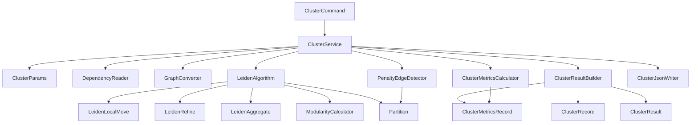

# cluster — План реализации

## Обзор

Команда `spring-twin cluster` выполняет кластеризацию графа зависимостей с использованием алгоритма Лейдена (Leiden Algorithm) для неориентированного графа. На вход принимается `dependencies.json`, на выходе формируется `clusters.json` с кластерами, метриками и штрафными рёбрами.

## Алгоритм Лейдена

Алгоритм Лейдена состоит из трёх фаз, повторяющихся до сходимости:

1. **Local Moving** — узлы перемещаются между сообществами для максимизации модулярности
2. **Refinement** — сообщества проверяются на стабильность, нестабильные разделяются
3. **Aggregation** — граф агрегируется по сообществам, образуя новый граф

Параметры:
- `resolution` — определяет размер кластеров (0.5–5.0), по умолчанию 1.5
- Количество итераций не ограничено, алгоритм работает до схождения
- Seed задается случайно

## Архитектура

## Пакеты

| Пакет | Назначение |
|-------|-----------|
| `spring.twin.cluster` | Основные классы cluster |
| `spring.twin.command` | CLI команды |

## Порядок реализации

| #   | Реализация | Фича                  | Описание                                                        | Зависимости       |
|-----|------------|-----------------------|-----------------------------------------------------------------|-------------------|
| 001 | +          | cluster-params        | DTO параметров команды cluster                                  | —                 |
| 002 | +          | dependency-reader     | Чтение dependencies.json в Map                                  | —                 |
| 003 | -          | graph-converter       | Конвертация направленного графа зависимостей в ненаправленный взвешенный | —           |
| 004 | -          | partition-model       | Модель данных разбиения графа на сообщества                     | —                 |
| 005 | -          | modularity-calculator | Вычисление модулярности и прироста модулярности                 | 003, 004          |
| 006 | -          | leiden-local-move     | Фаза локального перемещения узлов алгоритма Лейдена             | 004, 005          |
| 007 | -          | leiden-refine         | Фаза уточнения сообществ алгоритма Лейдена                      | 004, 005          |
| 008 | -          | leiden-aggregate      | Фаза агрегации графа алгоритма Лейдена                          | 003, 004          |
| 009 | -          | leiden-algorithm      | Полный алгоритм Лейдена — оркестрация трёх фаз                  | 006, 007, 008     |
| 010 | -          | cluster-metrics       | Вычисление метрик cohesion и coupling для кластеров             | —                 |
| 011 | -          | penalty-edges         | Обнаружение штрафных рёбер между кластерами                     | 004               |
| 012 | -          | cluster-result        | Модели данных результата кластеризации                          | 004, 010, 011     |
| 013 | -          | cluster-json-writer   | Запись clusters.json                                            | 012               |
| 014 | -          | cluster-service       | Главный сервис пайплайна cluster                                | 001–003, 009, 012, 013 |
| 015 | -          | cluster-command       | CLI команда cluster                                             | 001, 014          |
| 016 | -          | e2e-tests             | End-to-end тесты полного пайплайна cluster                      | 015               |

## Чек-лист задач

Каждая фича имеет 4 задачи в порядке реализации: **api** → **tests** → **code** → **fix**

### Фича 001: cluster-params
- [+] [001-cluster-params-api](cluster/001-cluster-params-api.md)
- [+] [001-cluster-params-tests](cluster/001-cluster-params-tests.md)
- [+] [001-cluster-params-code](cluster/001-cluster-params-code.md)
- [+] [001-cluster-params-fix](cluster/001-cluster-params-fix.md)

### Фича 002: dependency-reader
- [+] [002-dependency-reader-api](cluster/002-dependency-reader-api.md)
- [+] [002-dependency-reader-tests](cluster/002-dependency-reader-tests.md)
- [+] [002-dependency-reader-code](cluster/002-dependency-reader-code.md)
- [+] [002-dependency-reader-fix](cluster/002-dependency-reader-fix.md)

### Фича 003: graph-converter
- [ ] [003-graph-converter-api](cluster/003-graph-converter-api.md)
- [ ] [003-graph-converter-tests](cluster/003-graph-converter-tests.md)
- [ ] [003-graph-converter-code](cluster/003-graph-converter-code.md)
- [ ] [003-graph-converter-fix](cluster/003-graph-converter-fix.md)

### Фича 004: partition-model
- [ ] [004-partition-model-api](cluster/004-partition-model-api.md)
- [ ] [004-partition-model-tests](cluster/004-partition-model-tests.md)
- [ ] [004-partition-model-code](cluster/004-partition-model-code.md)
- [ ] [004-partition-model-fix](cluster/004-partition-model-fix.md)

### Фича 005: modularity-calculator
- [ ] [005-modularity-calculator-api](cluster/005-modularity-calculator-api.md)
- [ ] [005-modularity-calculator-tests](cluster/005-modularity-calculator-tests.md)
- [ ] [005-modularity-calculator-code](cluster/005-modularity-calculator-code.md)
- [ ] [005-modularity-calculator-fix](cluster/005-modularity-calculator-fix.md)

### Фича 006: leiden-local-move
- [ ] [006-leiden-local-move-api](cluster/006-leiden-local-move-api.md)
- [ ] [006-leiden-local-move-tests](cluster/006-leiden-local-move-tests.md)
- [ ] [006-leiden-local-move-code](cluster/006-leiden-local-move-code.md)
- [ ] [006-leiden-local-move-fix](cluster/006-leiden-local-move-fix.md)

### Фича 007: leiden-refine
- [ ] [007-leiden-refine-api](cluster/007-leiden-refine-api.md)
- [ ] [007-leiden-refine-tests](cluster/007-leiden-refine-tests.md)
- [ ] [007-leiden-refine-code](cluster/007-leiden-refine-code.md)
- [ ] [007-leiden-refine-fix](cluster/007-leiden-refine-fix.md)

### Фича 008: leiden-aggregate
- [ ] [008-leiden-aggregate-api](cluster/008-leiden-aggregate-api.md)
- [ ] [008-leiden-aggregate-tests](cluster/008-leiden-aggregate-tests.md)
- [ ] [008-leiden-aggregate-code](cluster/008-leiden-aggregate-code.md)
- [ ] [008-leiden-aggregate-fix](cluster/008-leiden-aggregate-fix.md)

### Фича 009: leiden-algorithm
- [ ] [009-leiden-algorithm-api](cluster/009-leiden-algorithm-api.md)
- [ ] [009-leiden-algorithm-tests](cluster/009-leiden-algorithm-tests.md)
- [ ] [009-leiden-algorithm-code](cluster/009-leiden-algorithm-code.md)
- [ ] [009-leiden-algorithm-fix](cluster/009-leiden-algorithm-fix.md)

### Фича 010: cluster-metrics
- [ ] [010-cluster-metrics-api](cluster/010-cluster-metrics-api.md)
- [ ] [010-cluster-metrics-tests](cluster/010-cluster-metrics-tests.md)
- [ ] [010-cluster-metrics-code](cluster/010-cluster-metrics-code.md)
- [ ] [010-cluster-metrics-fix](cluster/010-cluster-metrics-fix.md)

### Фича 011: penalty-edges
- [ ] [011-penalty-edges-api](cluster/011-penalty-edges-api.md)
- [ ] [011-penalty-edges-tests](cluster/011-penalty-edges-tests.md)
- [ ] [011-penalty-edges-code](cluster/011-penalty-edges-code.md)
- [ ] [011-penalty-edges-fix](cluster/011-penalty-edges-fix.md)

### Фича 012: cluster-result
- [ ] [012-cluster-result-api](cluster/012-cluster-result-api.md)
- [ ] [012-cluster-result-tests](cluster/012-cluster-result-tests.md)
- [ ] [012-cluster-result-code](cluster/012-cluster-result-code.md)
- [ ] [012-cluster-result-fix](cluster/012-cluster-result-fix.md)

### Фича 013: cluster-json-writer
- [ ] [013-cluster-json-writer-api](cluster/013-cluster-json-writer-api.md)
- [ ] [013-cluster-json-writer-tests](cluster/013-cluster-json-writer-tests.md)
- [ ] [013-cluster-json-writer-code](cluster/013-cluster-json-writer-code.md)
- [ ] [013-cluster-json-writer-fix](cluster/013-cluster-json-writer-fix.md)

### Фича 014: cluster-service
- [ ] [014-cluster-service-api](cluster/014-cluster-service-api.md)
- [ ] [014-cluster-service-tests](cluster/014-cluster-service-tests.md)
- [ ] [014-cluster-service-code](cluster/014-cluster-service-code.md)
- [ ] [014-cluster-service-fix](cluster/014-cluster-service-fix.md)

### Фича 015: cluster-command
- [ ] [015-cluster-command-api](cluster/015-cluster-command-api.md)
- [ ] [015-cluster-command-tests](cluster/015-cluster-command-tests.md)
- [ ] [015-cluster-command-code](cluster/015-cluster-command-code.md)
- [ ] [015-cluster-command-fix](cluster/015-cluster-command-fix.md)

### Фича 016: e2e-tests
- [ ] [016-e2e-tests-api](cluster/016-e2e-tests-api.md)
- [ ] [016-e2e-tests-tests](cluster/016-e2e-tests-tests.md)
- [ ] [016-e2e-tests-code](cluster/016-e2e-tests-code.md)
- [ ] [016-e2e-tests-fix](cluster/016-e2e-tests-fix.md)